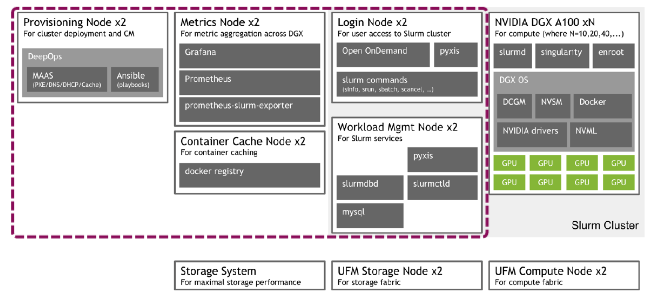
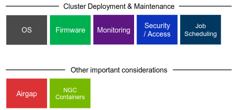
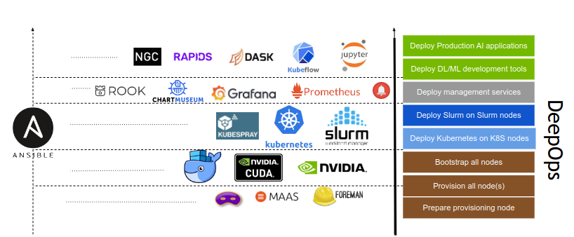
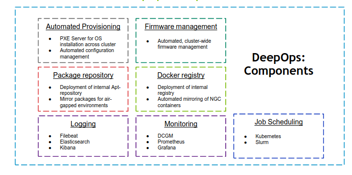
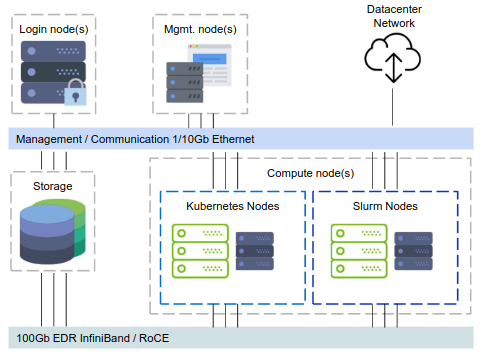
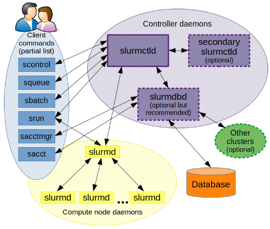
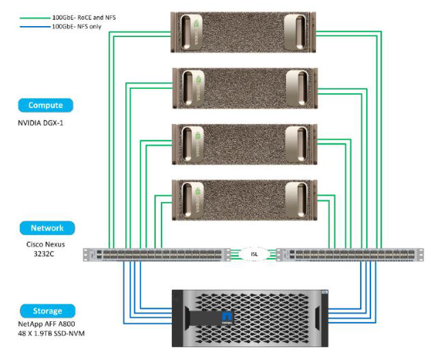

# 系统

## 基本概念

资源

- 作业运行过程中使用的可量化实体都是资源
- 包括硬件资源（节点、内存、CPU 、GPU等）和软件资源（ License ）

集群

- 包含计算、存储、网络等各种资源实体且彼此联系的资源集合；
- 在物理上，一般由计算处理、互联通信、I/O 存储、操作系统、编译器、
运行环境、开发工具等多个软硬件子系统组成；
- 节点是集群的基本组成单位，从角色上一般可以划分为管理节点、登陆节
点、计算节点、存储节点等。

作业

- 物理构成，一组关联的资源分配请求，以及一组关联的处理过程；
- 交互方式，可以分为交互式作业和非交互式作业；
- 资源使用，可以分为串行作业和并行作业；

分区

- 带名称的作业容器；
- 用户访问控制；
- 资源使用限制；

作业调度系统（Job Schedule System）

- 负责监控和管理集群中资源和作业的软件系统；
- 通常由资源管理器、调度器、任务执行器，以及用户命令和API组成；

## HPC集群

传统的HPC集群有文件系统和计算系统。

文件系统（File System）是集群中负责管理和存储文件信息的软件架构，用于向用户提供底层数据访问。

计算系统（Computing System）是集群中负责提供计算资源、执行计算操作的节点集合。

<figure markdown>
  
  <figcaption>System</figcaption>
</figure>

<figure markdown>
  
  <figcaption>Example Hardware</figcaption>
</figure>

## NVIDIA DGX SuperPOD

<figure markdown>
  
  <figcaption>Example deployment with depolyed software on each respective host System</figcaption>
</figure>

## DeepOps

<figure markdown>
  
  <figcaption>From a shiny new DGX POD</figcaption>
</figure>

- 这个开源项目旨在简化在本地、可选择离线数据中心或云环境中部署多节点 GPU 集群的深度学习和高性能计算环境。
- DeepOps 也被认可为 DGX POD 管理软件。
- 该项目的模块化性质还允许经验丰富的管理员挑选和选择可能有用的组件，使得该过程与他们现有的软件或基础架构兼容。

<figure markdown>
  
  <figcaption>DGX POD Management Software</figcaption>
</figure>

<figure markdown>
  
  <figcaption>DeepOps Components</figcaption>
</figure>

GPU Compute node(s):

- For high-performance compute workloads

Management node(s):

- Used for cluster management

Provisioning node:

- Orchestrates the initial setup of the cluster

### Architecture

<figure class="inline end" markdown>
  
  <figcaption>Building Multi-node GPU Clusters with DeepOps</figcaption>
</figure>

- 1x CPU-only login node
- Odd number of CPU-only management nodes
    - required for etcd key-value store

- 1/10Gb Ethernet control & management networks
    - Management, connectivity, command & control

- Fully non-blocking fat-tree 100Gb EDR Infiniband topology
    - Use the biggest EDR IB core switch that fits

#### Scheduler

调度系统是面向集群的操作系统。

- 单一系统映像
    - 解决集群结构松散问题；
    - 统一用户接口，使用简化；
- 系统资源整合
    - 管理异构资源和异构系统；
- 多任务管理
    - 统一管理任务，避免冲突；
- 资源访问控制
    - 基于策略的资源访问控制；

| Kubernetes  | SLURM                                |
| ----------- | ------------------------------------ |
| Basic scheduling features   | Advanced scheduling features  |
| Share nodes, schedule jobs for GPUs on a node<br>(current best solution: Excel spreadsheet)       | Multi-node jobs<br>Job dependencies, workflows, DAGs<br>Advanced reservations<br>Intelligent scheduling (not just FIFO)|
| Covers data permissions and security<br>(LDAP, file permissions) | Other HPC-like scheduling functionality |
| Adds analytics and monitoring<br>(important also for justification of purchase) | ... |

##### Kubernetes

- [ ] Prepare Provisioning Node
- [ ] Prepare Management Nodes
- [ ] Kubernetes Management Nodes
- [ ] Basic Cluster Services
- [ ] Provision Compute Nodes
- [ ] AAdditional Cluster Services 
- [ ] Kubernetes on Compute Nodes
- [ ] Deploy Kubeflow

Submit a GPU-enabled job to the GPU compute node(s)

```yaml
apiVersion: kubeflow.org/v1alpha2
kind: MPIJob
metadata:
  name: tensorflow-mpi-job
spec:
  slotsPerWorker: 1
  mpiReplicaSpecs:
    Launcher:
      replicas: 1
      template:
        spec:
          containers:
          - image: "nvcr.io/nvidia/tensorflow:21.03-tf1-py3"
            name: tensorflow-mpi-job-container
            command:
            - mpirun
            - -np
            - "4"
            - -bind-to
            - none
            - -map-by
            - slot
            - -x
            - NCCL_DEBUG=INFO
            - -x
            - LD_LIBRARY_PATH
            - -x
            - PATH
            - -mca
            - pml
            - ob1
            - -mca
            - btl
            - ^openib
            - --allow-run-as-root
            - python
            - /workspace/nvidia-examples/cnn/resnet.py
            - --layers
            - "50"
            - --batch_size
            - "512"
    Worker:
      # The number of workers (M)
      replicas: 4
      template:
        spec:
          containers:
          - image: "nvcr.io/nvidia/tensorflow:21.03-tf1-py3"
            name: tensorflow-mpi-job-container
            resources:
              limits:
                # The number of GPUs per-worker (N)
                nvidia.com/gpu: 1
```

#### Slurm

<figure class="inline end" markdown>
  
  <figcaption>Slurm components</figcaption>
</figure>

SLURM （Simple Linux Utility for Resource Management）是一种可扩展的工作负载管理器，已被全世界的国家超级计算机中心广泛采用。 它是免费且开源的，根据GPL通用公共许可证发行。

##### Slurm 概览

| Slurm       | 功能            |
| ----------- | -------------- |
| sinfo       | 集群状态        |
| squeue      | 排队作业状态     |
| sbatch      | 作业提交         |
| scontrol    | 查看和修改作业参数 |
| sacct       | 已完成作业报告    |
| scancel     | 删除作业        |

###### `sinfo` 查看集群状态

| Slurm       | 功能            |
| ----------- | -------------- |
| `sinfo -N`       | 查看节点级信息        |
| `sinfo -N --states=idle`      | 查看可用节点信息     |
| `sinfo --partition=cpu`       | 查看队列信息         |
| `sinfo --help`    | 查看所有选项 |

节点状态包括：
`drain` (节点故障)，`alloc`(节点在用)，`idle`(节点可用)，`down`(节点下线)，`mix` (节点部分占用，但仍有剩余资源）。

###### `squeue`查看作业信息

| Slurm       | 功能            |
| ----------- | -------------- |
| `squeue -j jobid`  | 查看作业信息       |
| `squeue -l`      | 查看细节信息     |
| `squeue -n HOST`       | 查看特定节点作业信息         |
| `squeue`    | 查看USER_LIST的作业 |
| `squeue --state=R`    | 查看特定状态的作业 |
| `squeue --help`    | 查看所有的选项 |
| `squeue -u <username>` | 列出用户的所有当前作业 |

作业状态包括`R`(正在运行)，`PD`(正在排队)，`CG`(即将完成)，`CD`(已完成)。

默认情况下，squeue只会展示在排队或在运行的作业。
```bash
$ squeue
JOBID PARTITION     NAME     USER ST       TIME  NODES NODELIST(REASON)
18046      dgx2   ZXLing     eenl  R    1:35:53      1 vol04
17796      dgx2   python    eexdl  R 3-00:22:04      1 vol02
```

###### `sbatch`作业提交
准备作业脚本然后通过sbatch提交是 Slurm 的最常见用法。 为了将作业脚本提交给作业系统，Slurm 使用

```bash
$ sbatch jobscript.slurm
```

Slurm 具有丰富的参数集。 以下最常用的。

| Slurm       | 含义            |
| ----------- | -------------- |
| `-n [count]` | 总进程数        |
| `--ntasks-per-node=[count]` | 每台节点上的进程数 |
| `-p [partition]` | 作业队列 |
| `--job-name=[name]` | 作业名 |
| `--output=[file_name]` | 标准输出文件 |
| `--error=[file_name]` | 标准错误文件 |
| `--time=[dd-hh:mm:ss]` | 作业最大运行时长 |
| `--exclusive` | 独占节点 |
|`--mail-type=[type]` | 通知类型，可选 all, fail, end，分别对应全通知、故障通知、结束通知 |
|`--mail-user=[mail_address]` | 通知邮箱 |
|`--nodelist=[nodes]` | 偏好的作业节点 |
| `--exclude=[nodes]` | 避免的作业节点 |
| `--depend=[state:job_id]` | 作业依赖 |
| `--array=[array_spec]` | 序列作业 |

批处理作业脚本由四个主要组成部分组成：

- 用于执行脚本的解释器
- "# "指令，用于传递默认提交选项。
- 设置环境和/或脚本变量（如果需要的话）
- 要执行的应用程序以及其输入参数和选项

以下是一个示例作业脚本，它在“science”计费账户下向cpu队列请求8个节点，并在分配的8个节点上启动32个myApp任务，并在作业完成时通知：

```bash
#!/bin/bash
#SBATCH -A science
#SBATCH --partition=cpu
#SBATCH -N 8 # 申请节点数为8,如果作业不能跨节点(MPI)运行, 申请的节点数应不超过1;
#SBATCH -n 32
#SBATCH --mail-type=end
#SBATCH --mail-user=YOU@EMAIL.COM
#SBATCH --output=%j.out # 脚本执行的输出将被保存在当%j.out文件下，%j表示作业号;
#SBATCH --error=%j.err 
#SBATCH --qos=low # 指定作业的QOS为low;
#SBATCH -J myFirstJob   # 作业在调度系统中的作业名为myFirstJob;

# Set environment variables if necessary

# Execute the application
myApp [arguments and options]
```

假设上面作业脚本的文件名为`job.sh`，通过以下命令提交：

```bash
sbatch job.sh
```

`squeue`可用于检查作业状态。用户可以在作业执行期间通过SSH登录到计算节点。输出将实时更新到文件`[jobid].out`和`[jobid].err`。

这里展示一个更复杂的作业要求，其中将启动80个进程，每台主机40个进程。

```bash
#!/bin/bash

#SBATCH --job-name=LINPACK
#SBATCH --partition=cpu # 作业提交的指定分区为cpu
#SBATCH -n 80
#SBATCH --ntasks-per-node=40 # 每个节点上运行40个任务，--ntasks参数的优先级高于该参数，默认一情况下也可理解为每个节点使用一个核心，如果程序不支持多线程(如openmp)，这个数不应该超过1;
#SBATCH --mail-type=end
#SBATCH --mail-user=YOU@EMAIL.COM
#SBATCH --output=%j.out
#SBATCH --error=%j.err
```

以下作业请求4张GPU卡，其中1个CPU进程管理1张GPU卡。

```bash
#!/bin/bash

#SBATCH --job-name=GPU_HPL
#SBATCH --partition=dgx2  # 作业提交的指定分区为dgx2;
#SBATCH -n 4
#SBATCH --ntasks-per-node=4
#SBATCH --gres=gpu:4 # 每个节点上申请4块GPU卡
#SBATCH --mail-type=end
#SBATCH --mail-user=YOU@MAIL.COM
#SBATCH --output=%j.out
#SBATCH --error=%j.err
```

以下作业启动一个3任务序列（从0到2），每个任务需要1个CPU内核。

```bash
#!/bin/bash

#SBATCH --job-name=python_array
#SBATCH --mail-user=YOU@MAIL.COM
#SBATCH --mail-type=ALL
#SBATCH --ntasks=1
#SBATCH --time=00:30:00
#SBATCH --array=0-2
#SBATCH --output=python_array_%A_%a.out
#SBATCH --output=python_array_%A_%a.err

module load miniconda2/4.6.14-gcc-4.8.5

source activate YOUR_ENV_NAME

echo "SLURM_JOBID: " $SLURM_JOBID
echo "SLURM_ARRAY_TASK_ID: " $SLURM_ARRAY_TASK_ID
echo "SLURM_ARRAY_JOB_ID: " $SLURM_ARRAY_JOB_ID

python < vec_${SLURM_ARRAY_TASK_ID}.py
```

###### `srun` 和 `salloc` 交互式作业

`srun` 可以启动交互式作业。该操作将阻塞，直到完成或终止。

```bash
$ srun -N 1 -n 4 -p small hostname
cas006
```

启动远程主机bash终端：

```bash
srun -p small -n 4 --exclusive --pty /bin/bash
```

或者，可以通过salloc请求资源，然后在获取节点后登录到计算节点：

```bash
salloc -N 1 -n 4 -p small
ssh casxxx
```

###### `scontrol`: 查看和修改作业参数

| Slurm                          | 功能                                     |
|--------------------------------|------------------------------------------|
| `scontrol show job JOB_ID`      | 查看排队或正在运行的作业的信息                 |
| `scontrol hold JOB_ID`         | 暂停JOB_ID                               |
| `scontrol release JOB_ID`       | 恢复JOB_ID                               |
| `scontrol update dependency=JOB_ID` | 添加作业依赖性 ，以便仅在JOB_ID完成后才开始作业 |

`scontrol hold` 命令可使排队中尚未运行的作业暂停被分配运行，被挂起的作业将不被执行。`scontrol release` 命令可取消挂起。

###### `sacct`查看作业记录

| Slurm                       | 功能                                    |
|-------------------------------|-----------------------------------------|
| `sacct -l`                   | 查看详细的帐户作业信息                      |
| `sacct --states=R`           | 查看具有特定状态的作业的帐号作业信息           |
| `sacct -S YYYY-MM-DD`        | 在指定时间后选择处于任意状态的作业            |
| `sacct --format=“LAYOUT”`   | 使用给定的LAYOUT自定义sacct输出             |
| `sacct --help`               | 查看所有选项                              |

默认情况下，`sacct`显示过去<strong>24小时</strong>的帐号作业信息。

`scontrol show job` 只能显示正在运行或者刚结束没多久的作业信息；通过`sacct`查询已经结束作业的相关信息。

##### Slurm环境变量

| 变量                      | 描述                                   |
|-------------------------|--------------------------------------|
| `SLURM_JOB_ID`           | 作业ID                                |
| `SLURM_JOB_NAME`         | 作业名称                              |
| `SLURM_JOB_PARTITION`    | 队列名称                              |
| `SLURM_NTASKS`           | 进程总数                              |
| `SLURM_NTASKS_PER_NODE`  | 每个节点请求的任务数                 |
| `SLURM_JOB_NUM_NODES`    | 节点数                                |
| `SLURM_JOB_NODELIST`     | 节点列表                              |
| `SLURM_LOCALID`          | 作业中进程的节点本地任务ID           |
| `SLURM_ARRAY_TASK_ID`    | 作业序列中的任务ID                    |
| `SLURM_SUBMIT_DIR`       | 工作目录                              |
| `SLURM_SUBMIT_HOST`      | 提交作业的主机名                      |

### Ansible

Ansible 是一款来自 Red Hat 的配置管理工具，正在迅速成DevOps 风格系统管理的标准工具。Ansible 提供了一种声明性的管理硬件和软件的方法，管理员可以使用一组易于阅读的 YAML 文件指定配置的预期状态。这使得基础架构的状态可以像任何其他软件代码一样通过版本控制和变更验证流程进行管理。

Ansible 使用名为 "角色（Roles）" 的概念，提供一组标准任务，可以通过更改一些变量在多次执行或多个设备上执行。

为了演示这一点，我创建了三个独立的角色：一个用于 A800 存储设备，一个用于Nexus 交换机的网络设备，以及一个用于 DGX-1 服务器。每个角色包含特定设备的任务，以及完成配置所需的默认变量或其他文件。

<figure markdown>
  
  <figcaption>ONTAP AI solution verified architecture</figcaption>
</figure>
